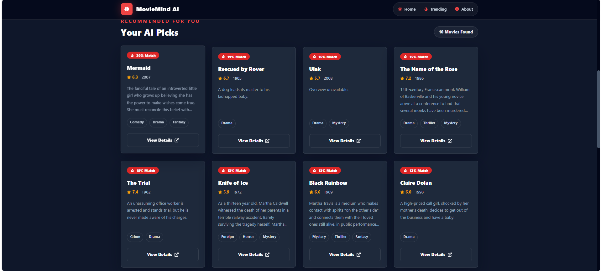
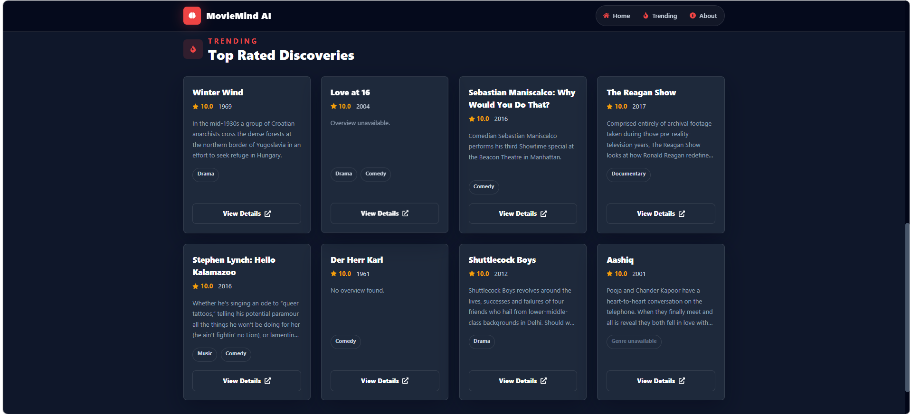

# 🎬 MovieMind AI - Intelligent Movie Recommendation Engine

[](https://python.org)
[](https://www.javascript.com)
[](https://flask.palletsprojects.com)
[](https://react.dev)
[](LICENSE)

**MovieMind AI** is a full-stack intelligent movie recommendation web application that leverages AI-powered algorithms to discover movies tailored to your preferences. Powered by TF-IDF and cosine similarity analysis, this system analyzes movie metadata and delivers personalized recommendations in real-time.

---

## 🌟 Features

✨ **Smart Recommendations** - AI-powered suggestions based on TF-IDF cosine similarity  
🎯 **Real-time Search** - Instant movie search with autocomplete functionality  
📊 **Rich Movie Data** - Complete movie information including ratings, overviews, and genres  
🎨 **Modern UI** - Beautiful, responsive interface with smooth animations  
⚡ **Fast Performance** - Optimized backend with pre-computed models  
📱 **Mobile Friendly** - Fully responsive design for all devices  
🔄 **Trending Movies** - Discover top-rated and trending films  

---

## 📸 Screenshots

### Home Page

*Get started with a beautiful, intuitive interface to search for your favorite movies*

### Movie Suggestions

*Autocomplete suggestions appear as you type to help you find movies quickly*

### Recommendation Results

*View personalized recommendations with ratings, genres, and detailed information*

---

## 🏗️ Project Architecture

```
MovieMind-AI/
├── 📁 backend/                    # Flask REST API
│   ├── app.py                    # Flask application entry point
│   ├── recommendation.py         # Recommendation engine logic
│   ├── requirements.txt          # Python dependencies
│   │
│   ├── 📁 models/                # Pre-trained models & data
│   │   ├── movies_df.pkl        # Processed movies dataframe
│   │   ├── tfidf_matrix.pkl     # TF-IDF vectorized matrix
│   │   ├── tfidf_vectorizer.pkl # Fitted vectorizer
│   │   ├── indices.pkl          # Movie indices mapping
│   │   └── movies_metadata.csv  # Raw movie database
│   │
│   └── 📁 routes/                # API endpoints
│       └── movie_routes.py       # Movie recommendation routes
│
├── 📁 frontend/                   # React + Vite Frontend
│   ├── package.json             # NPM dependencies
│   ├── vite.config.js           # Vite configuration
│   ├── tailwind.config.js       # Tailwind CSS config
│   ├── postcss.config.js        # PostCSS configuration
│   │
│   ├── 📁 src/
│   │   ├── main.jsx             # React entry point
│   │   ├── App.jsx              # Main app component
│   │   ├── index.css            # Global styles
│   │   │
│   │   ├── 📁 components/       # Reusable components
│   │   │   ├── Navbar.jsx       # Navigation bar
│   │   │   ├── Hero.jsx         # Hero section
│   │   │   ├── SearchBox.jsx    # Search input component
│   │   │   ├── MovieCard.jsx    # Movie display card
│   │   │   ├── RecommendationGrid.jsx # Grid of recommendations
│   │   │   ├── TrendingMovies.jsx     # Trending section
│   │   │   └── Footer.jsx       # Footer component
│   │   │
│   │   ├── 📁 pages/
│   │   │   └── Home.jsx         # Home page
│   │   │
│   │   └── 📁 services/
│   │       └── api.js           # API client service
│   │
│   └── 📁 public/               # Static assets
│
├── 📁 screenshot/               # Application screenshots
│   ├── Suggestion.png          # Search suggestions demo
│   └── recommendation_result.png # Results page demo
│
├── Home.png                     # Home page screenshot
├── notebook.ipynb              # Jupyter notebook with analysis
├── .gitignore                  # Git ignore rules
└── README.md                   # This file
```

---

## 🚀 Quick Start

### Prerequisites
- Python 3.8 or higher
- Node.js 14 or higher
- npm or yarn package manager

### Backend Setup

```bash
# Navigate to backend directory
cd backend

# Create virtual environment (Windows)
python -m venv venv
venv\Scripts\activate

# Create virtual environment (macOS/Linux)
python -m venv venv
source venv/bin/activate

# Install dependencies
pip install -r requirements.txt

# Run the Flask server
python app.py
```

The Flask API will start at `http://localhost:5000`

### Frontend Setup

```bash
# Navigate to frontend directory
cd frontend

# Install dependencies
npm install

# Start development server
npm run dev
```

The React app will be available at `http://localhost:5173`

---

## 🔌 API Documentation

### Get All Movies
**Endpoint:** `GET /movies`

Returns a list of all available movie titles for autocomplete functionality.

**Response:**
```json
{
  "movies": [
    "Toy Story",
    "Jumanji",
    "Avatar",
    ...
  ]
}
```

---

### Get Recommendations
**Endpoint:** `POST /recommend`

Get personalized movie recommendations based on a selected movie.

**Request:**
```http
POST /recommend
Content-Type: application/json

{
  "movie": "Avatar",
  "limit": 10
}
```

**Response:**
```json
{
  "recommendations": [
    {
      "title": "Avatar: The Way of Water",
      "poster": "https://image.tmdb.org/t/p/w500/...",
      "rating": 7.8,
      "overview": "Avatar: The Way of Water...",
      "release_year": 2022,
      "genres": ["Science Fiction", "Adventure"],
      "similarity_score": 0.95
    },
    ...
  ]
}
```

---

### Get Trending Movies
**Endpoint:** `GET /trending?limit=8`

Returns random top-rated movies from the metadata database.

**Query Parameters:**
- `limit` (optional, default: 8) - Number of movies to return

**Response:**
```json
{
  "trending": [
    {
      "title": "The Shawshank Redemption",
      "poster": "https://image.tmdb.org/t/p/w500/...",
      "rating": 9.3,
      "overview": "Two imprisoned men bond over a number of years...",
      "genres": ["Drama"],
      "release_year": 1994
    },
    ...
  ]
}
```

---

## 🧠 Recommendation Algorithm

MovieMind AI uses **TF-IDF (Term Frequency-Inverse Document Frequency)** combined with **Cosine Similarity** for intelligent recommendations.

### How it Works:

1. **Data Processing**
   - Extracts title, overview, genres, and taglines from movies_metadata.csv
   - Cleans and preprocesses text data
   - Combines features into a comprehensive "tags" field

2. **Vectorization**
   - Converts text into numerical vectors using TF-IDF
   - Creates a sparse matrix representation of all movies

3. **Similarity Calculation**
   - Computes cosine similarity between the selected movie and all others
   - Ranks movies by similarity score (0 to 1)
   - Returns top-N recommendations

4. **Result Enrichment**
   - Adds movie posters, ratings, and metadata
   - Falls back to placeholder images if poster URLs are unavailable

---

## 🛠️ Technology Stack

### Backend
- **Flask** - Lightweight web framework for Python
- **Python 3.8+** - Core programming language
- **Scikit-learn** - Machine learning library (TF-IDF, cosine similarity)
- **Pandas** - Data manipulation and analysis
- **NumPy** - Numerical computations
- **CORS** - Cross-Origin Resource Sharing support

### Frontend
- **React 18** - UI library and component framework
- **Vite** - Next-generation build tool
- **Tailwind CSS** - Utility-first CSS framework
- **Framer Motion** - Animation library
- **Axios** - HTTP client for API requests
- **JavaScript ES6+** - Modern JavaScript features

### Data & ML
- **TF-IDF Vectorizer** - Text feature extraction
- **Cosine Similarity** - Distance metric for recommendations
- **Pickle** - Model serialization and storage
- **TMDB Database** - Movie metadata source

---

## 📋 Environment Configuration

### Backend Configuration

Set environment variables in `backend/.env` (optional):

```env
FLASK_ENV=development
FLASK_APP=app.py
CORS_ORIGINS=http://localhost:5173
```

### Frontend Configuration

Create `frontend/.env.local` to customize API endpoints:

```env
VITE_API_URL=http://localhost:5000
```

---

## 🐛 Troubleshooting

### Issue: "Cannot connect to API"
- Ensure Flask backend is running on `http://localhost:5000`
- Check if port 5000 is not already in use
- Verify `VITE_API_URL` is correctly set in frontend

### Issue: "CORS error in browser console"
- Make sure Flask has CORS enabled
- Update `FRONTEND_ORIGIN` in Flask if needed
- Clear browser cache and restart dev server

### Issue: "Module not found" errors
- Run `pip install -r requirements.txt` for backend
- Run `npm install` for frontend
- Verify Python/Node versions meet requirements

### Issue: "Models not loading"
- Ensure all `.pkl` files exist in `backend/models/`
- Check file paths are correct
- Re-train models if files are corrupted

---

## 📈 Dataset Information

- **Total Movies:** 45,466
- **Movie Database:** TMDB (The Movie Database)
- **Data Features:** Title, Overview, Genres, Tagline, Rating, Popularity
- **Coverage:** Movies from various eras and genres globally

---

## 🤝 Contributing

Contributions are welcome! Here's how you can help:

1. **Fork** the repository
2. **Create** a feature branch (`git checkout -b feature/AmazingFeature`)
3. **Commit** your changes (`git commit -m 'Add AmazingFeature'`)
4. **Push** to the branch (`git push origin feature/AmazingFeature`)
5. **Open** a Pull Request

---

## 📝 License

This project is licensed under the MIT License - see the [LICENSE](LICENSE) file for details.

---

## 🎯 Future Enhancements

- 🔐 User authentication and profiles
- ❤️ Save favorite movies and recommendations
- 📊 User rating system and reviews
- 🌍 Multi-language support
- 🤖 Deep learning models (Neural Networks)
- 📱 Mobile app versions (iOS/Android)
- 🎬 Social sharing features
- 🔍 Advanced filtering (year, genre, rating range)

---

## 💡 Support & Contact

Have questions or suggestions? Feel free to:
- Open an [Issue](https://github.com/BaljeetkumarPatel/Movie-recommendation-System/issues)
- Create a [Discussion](https://github.com/BaljeetkumarPatel/Movie-recommendation-System/discussions)
- Reach out via GitHub

---

## 🙏 Acknowledgments

- **TMDB** (The Movie Database) for the comprehensive movie dataset
- **Scikit-learn** for machine learning algorithms
- **React** and **Flask** communities for excellent frameworks
- **Tailwind CSS** for beautiful styling utilities

---

**Happy movie hunting! 🍿🎭**

*Made with ❤️ by Baljeet Kumar Patel*
